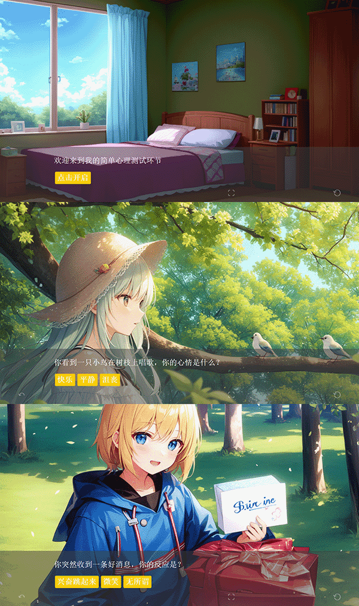

🎮 游戏名称: Twine

📚 游戏简介: Twine 是一款开源、跨平台的交互式故事创作工具，让你能够轻松地制作和分享文本驱动的游戏和互动故事。它的简单易用界面和强大功能，使得没有编程经验的人也能够创造各种趣味引人的游戏体验。

✨ 游戏特色:
- 可视化故事编写：Twine 提供了强大的可视化编辑器，让你可以轻松创建场景、连接故事线和设定不同的选项。
- 无需编程知识：使用 Twine，你不需要具备编程技能，仅凭直觉就能够创建复杂的故事情节和互动元素。
- 跨平台支持：Twine 可以在多个平台上运行，包括 Windows、Mac 和 Linux，以及各种现代网络浏览器。
- 社区分享：Twine 拥有庞大的社区，你可以与其他用户分享你的作品、获取灵感和互动体验。

🖼️ 游戏截图：



这些指令在Twine编辑器的=》(Macro:)=》window里面可以找到。里面指令没有去汉化。

# Twine编辑器 demo
https://www.cnbbx.com/twine/

# 示例图片的 demo
https://www.cnbbx.com/story/%E7%AE%80%E5%8D%95%E5%BF%83%E7%90%86%E6%B5%8B%E8%AF%95.html

# 示例代码
> [main] 第一页不能设置播放音乐
```
(enchant:?Page,(background:'/story/module/138086367_0_final.png'))
(mp3-url:'/story/module/bgm_665171_03.mp3')
(mp3-set:false)
(mp3-loop:true)
欢迎来到我的简单心理测试环节

[[点击开启->开始]]
```
> [开始] 必须第二页设置播放音乐
```
(enchant:?Page,(background:'/story/module/138086367_0_final.png'))
(mp3-set:true)
你现在心情如何？

[[很好 -> 开始测试1]]
[[一般 -> 开始测试2]]
[[不好 -> 开始测试3]]
```

##	Example usage:
```
music1 是指定对象  可以自行添加很多音乐对象
(mp3-url:'http://***.com/*.mp3')
(mp3-url:'http://***.com/*.mp3','music1')
(mp3-set:true)是播放音乐
(mp3-set:false)是暂停音乐
(mp3-set:true,'music1')是播放音乐
(mp3-set:false,'music1')是暂停音乐
(mp3-loop:true)是循环播放
(mp3-loop:false)是取消循环播放
(mp3-loop:true,'music1')是循环播放
(mp3-loop:false,'music1')是取消循环播放
```

# **WebGalgame（网页游戏）**

WebGalgame 是一种基于网页技术开发的游戏类型，以文本、图像和音频为主要元素，让玩家通过浏览器在线进行游戏。以下是 WebGalgame 的介绍：

## **游戏概述**

WebGalgame 是一种以剧情为核心、通过网页进行游玩的游戏形式。玩家可以通过点击、选择选项、解谜等方式进行游戏进程的推进。相较于传统的游戏形式，WebGalgame 融合了网页技术的优势，提供了更多自由度和互动性。

## **特点与优势**

- **易于访问**：玩家无需下载或安装额外软件，只需打开浏览器，即可随时随地畅玩游戏。
- **无平台限制**：WebGalgame 可以在多个平台上运行，包括桌面电脑、笔记本电脑、平板电脑和手机等设备。
- **丰富的表现形式**：通过网页技术，WebGalgame 可以展现丰富的文本、图像、音频和动画效果，为玩家提供沉浸式的游戏体验。
- **轻松分享**：玩家可以轻松地将 WebGalgame 分享给其他人，提供更多互动和留存价值。

## **相关工具与技术**

开发者通常使用以下工具和技术来创建 WebGalgame：

- **HTML**：用于创建游戏界面和布局。
- **CSS**：用于美化游戏界面、添加样式和动效。
- **JavaScript**：用于实现游戏的互动逻辑、场景切换和选项选择等功能。
- **媒体文件**：如图像、音频和视频等，用于增强游戏的视听效果。

## **成功示例**

WebGalgame 的成功示例包括《恋与制作人》、《命运-冠位指定 》等。这些游戏在玩家中积累了庞大的用户群体，并在市场上取得了巨大成功。

希望这份介绍对你有所帮助！如果你还有其他问题或需要进一步帮助，请随时告诉我！😊